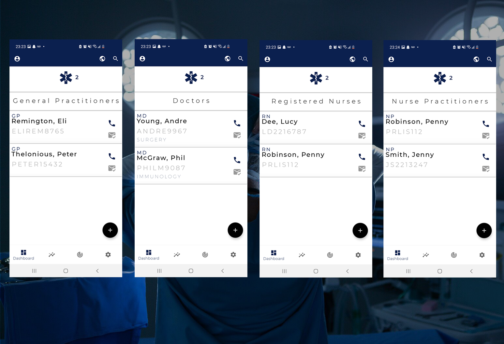
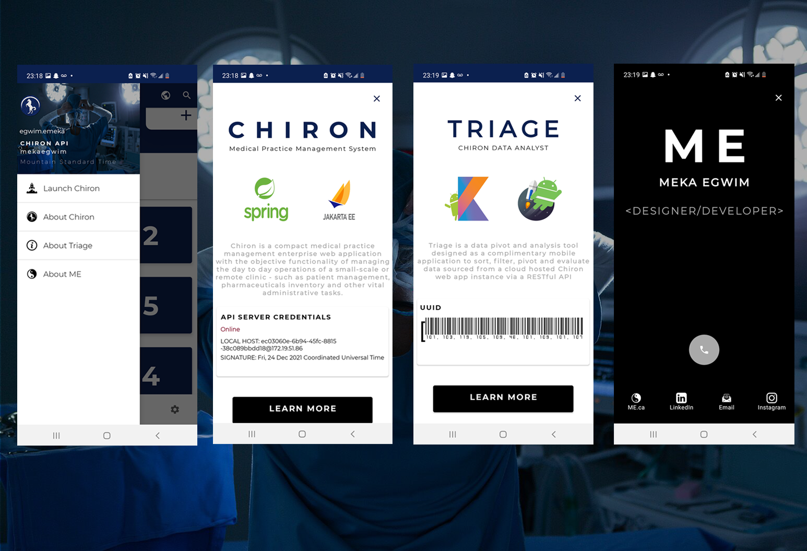
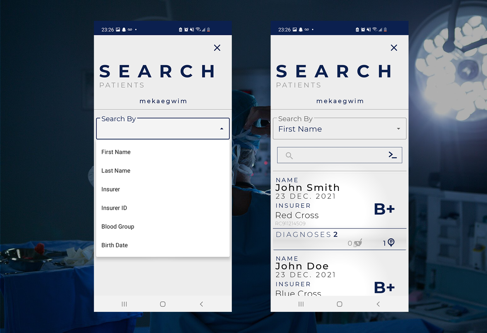
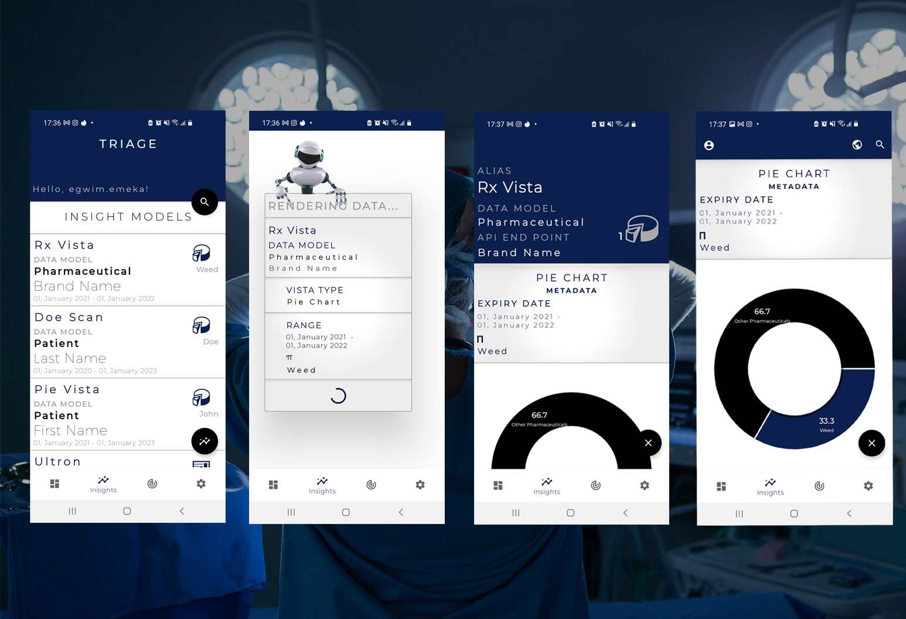
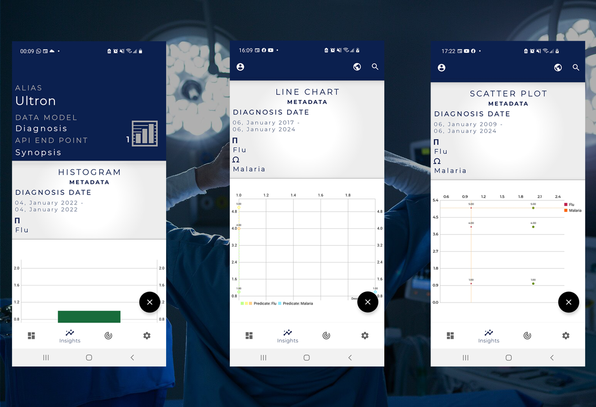
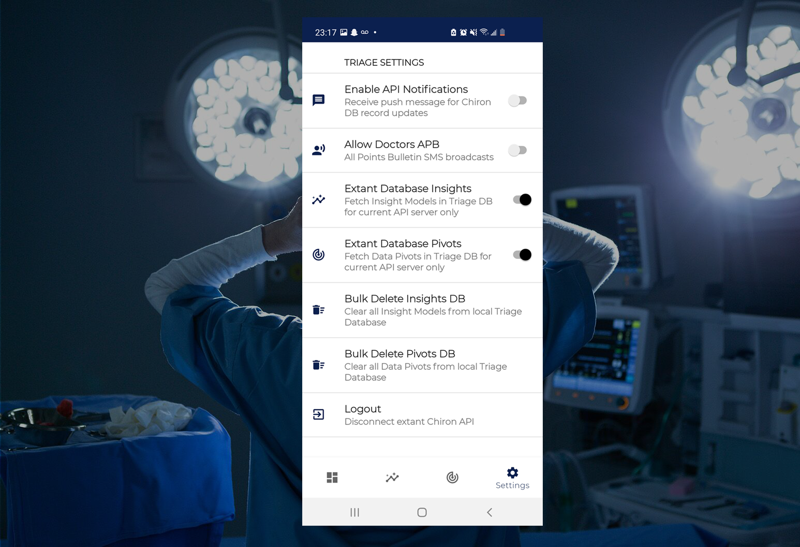

# Triage /trēˈäZH/
## Chiron Medical Practice Management System - Mobile Data Pivot & Analysis Tool (Android MVVM)

### Overview
<p align="justify">Triage is a data pivot and analysis tool designed as a complimentary mobile application to sort, filter, pivot and evaluate data sourced from a Chiron web app instance via a RESTful API. The application architecture design is based on the MVVM approach Built using Kotlin, SQLite, Retrofit, Material Design, Android Jetpack Architecture Components and Firebase Real Time Database & Machine Learning.</p>

## Related Links

**Portfolio URL >_** https://www.mekaegwim.ca/portfolio/
<br>
**Chiron Demo URL >_** https://chiron-cloudapp.herokuapp.com/
<br>
**Chiron Git >_** https://github.com/emeraldemperaur/chiron

## System Requirements

```
> Android 10 Operating System or Higher
> Internet Connection
> Hosted Chiron Cloud App 

```

<br><br>
### UI/UX Screenshots
&nbsp;
#### Login
&nbsp;

&nbsp;
#### Dashboard
&nbsp;

&nbsp;

&nbsp;

&nbsp;

&nbsp;
#### Search
&nbsp;

&nbsp;
#### Insight Models
&nbsp;

&nbsp;

&nbsp;
#### Data Pivots
&nbsp;

&nbsp;
#### Preferences
&nbsp;

&nbsp;